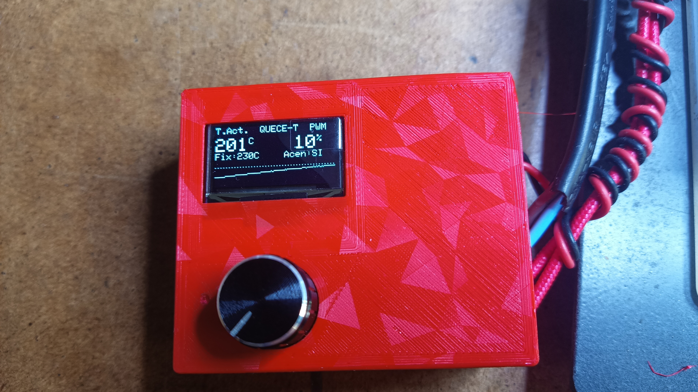
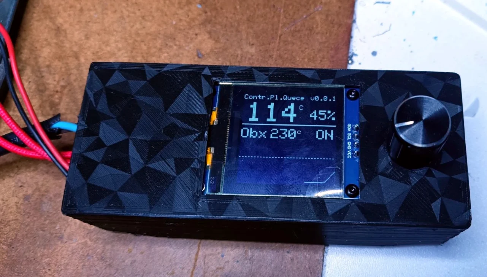

#  Plataforma de Soldadura (Control de Temperatura)

> [!NOTE]
> Documentacion en galego

Este repositorio conten o deseno de hardware, esquema e firmware para o desenvolvemento dun **controlador termico intelixente** aplicado a unha placa calefactora de 230Vac. O sistema esta desenado para labores de soldadura e desoldadura de componentes SMD/THD en proxectos persoais, educativos e experimentais.

---

## Versions do Proxecto

O repositorio esta dividido en duas variantes segundo o microcontrolador utilizado:

### 1. [Plataforma_sold_ATmega328p](./Plataforma_sold_ATmega328p)

- **Microcontrolador:** ATmega328P-AU (TQFP-32).
- **Descricion:** Version mais lixeira e eficiente baseada na arquitectura clasica de Arduino. Demostra que non e preciso usar un potente ESP32 para realizar este traballo.
**Caracteristicas:** Control de potencia, visualizacion en pantalla OLED 128x64 (SSD1306) e illamento galvanico.

**[Ver documentacion e BOM do ATmega328P](./Plataforma_sold_ATmega328p)**

---

### 2. [Plataforma_sold_ESP32-C3](./Plataforma_sold_ESP32-C3)

**Microcontrolador:** ESP32-C3 SuperMini (RISC-V).
**Descricion:** Version baseada no chip ESP32-C3, aproveitando a sua maior velocidade de procesamento e conectividade.
**Caracteristicas:** Interface OLED I2C, control mediante encoder rotatorio e procesamento mais rapido da curva de temperatura.

**[Ver documentacion e BOM do ESP32-C3](./Plataforma_sold_ESP32-C3)**

---

##  Caracteristicas Xerais

Ambas versions comparten a seguinte arquitectura e funcionalidade basica:

- **Control Termico:** Axuste preciso da temperatura e control de potencia do elemento calefactor.
- **Seguridade:** Deteccion de fallos no termistor e corte de emerxencia por sobrequecemento (300 C).
- **Aisllamento:** Illamento galvanico mediante micro-fonte de alimentacion conmutada integrada na PCB.
- **Etapa de Potencia:** Control de carga AC a 230Vac mediante SSR / Triac (BTA06-400B e optoacoplador MOC3041).
- **Interface:** Pantalla OLED SSD1306 (128x64 px) e selector mediante encoder rotatorio e pulsador.

---

## Estrutura do Repositorio

* `Plataforma_sold_ATmega328p/`: Proxecto, PCB e BOM para ATmega328P
* `Plataforma_sold_ESP32-C3/`: Proxecto, PCB e BOM para ESP32-C3
* `README.md`: Descricion xeral do repositorio

---

Saúdos.